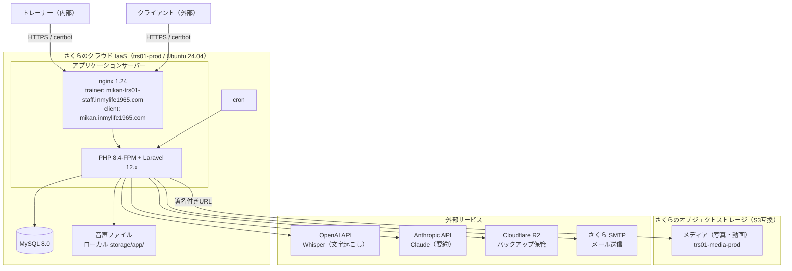

**位置づけ**: 仕様文書（アーキテクチャ設計書）
**対象読者**: 開発者
**上位文書**: requirements.md（全体）
**詳細**: 詳細は doc-index.md を参照

---

# アーキテクチャ設計書: トレーニング記録管理システム

## 1. システム全体像

### 1-1. 構成図

※ トレーナー（内部）とクライアント（外部）は別々のサブドメインから同一の Laravel アプリケーションに接続する。nginx が 2 つのサーバー名を受け、アプリ側でサブドメイン（本番）またはパス（ローカル）により経路を分ける。詳細は「2-4. インフラ・ミドルウェア」のサブドメイン構成を参照。

### 1-2. 構成の説明

本システムは、Webブラウザから利用するシステムである。
サーバー側の処理はさくらのクラウド IaaS 上で動作し、メディア保管にさくらのオブジェクトストレージを、その他の連携に外部サービスを利用する。

**利用者**

- **トレーナー（一般）**：クライアント情報・トレーニング記録などの登録・閲覧を利用する（内部利用者）
- **トレーナー（管理者）**：上記に加えて、利用者管理・マスタ管理等の機能を利用する（内部利用者）
- **システム管理者**：システム開発事業者が保守・緊急対応を行う
- **クライアント（飼い主）**：自分に紐づくトレーニング記録・メディアの閲覧のみを行う（外部利用者。初回設定が完了したクライアントのみ）

**利用環境**

- **PC**：Windows + Google Chrome
- **タブレット**：iPad + Google Chrome
- ※ 上記以外の環境（macOS、Linux、Chrome 以外のブラウザ、iPad 以外のタブレット、スマートフォン等）は動作保証対象外
- ※ クライアント（外部利用者）は自宅・スマートフォン等、機関の許可 IP 外からも閲覧する

**通信・サブドメイン**

- HTTPS による暗号化通信（Let's Encrypt を certbot で取得・自動更新）
- トレーナー（内部）とクライアント（外部）は別々のサブドメインから接続する
  - トレーナー用：`mikan-trs01-staff.inmylife1965.com`
  - クライアント用：`mikan.inmylife1965.com`
- 両サブドメインは同一の Laravel アプリケーションに接続し、アプリ側でサブドメイン（本番）またはパス（ローカル）により経路・セッション・IP 制限を分ける（詳細は 2-4 参照）

**アプリケーションサーバー（さくらのクラウド IaaS）**

- **サーバー**：trs01-prod（Ubuntu 24.04）
- **Webサーバー**：nginx 1.24
- **アプリケーション実行**：PHP 8.4-FPM + Laravel 12.x

**データベース（同一サーバー上）**

- MySQL 8.0

**ファイル保管**

- **音声ファイル**：サーバーローカルの storage/app/ 配下（文字起こし・要約のための中間生成物として、外部 API 送信を含めサーバーローカルで完結）
- **メディア（写真・動画）**：さくらのオブジェクトストレージ（S3 互換、`trs01-media-prod`）。クライアントへは署名付き URL で配信する
- **バックアップファイル**：Cloudflare R2（league/flysystem-aws-s3-v3 経由）

**外部サービス**

- **OpenAI API**：音声ファイルの文字起こしに使用（Whisper）
- **Anthropic API**：文字起こしの要約に使用（Claude）
- **メール送信**：さくらのレンタルサーバー SMTP（招待メール等の送信）

**運用**

- **バックアップ**：cron による自動実行
- **メンテナンス**：SSH 接続によるコマンド実行（バックアップ手動実行・リストア等）

---

## 2. 技術スタック

### 2-1. フロントエンド

| 項目 | 技術 | 説明（選定理由など） |
|------|------|---------|
| テンプレートエンジン | Blade（Laravel標準） | Laravelと統合されており、追加設定なしで使える。サーバーサイドで画面を生成するため、SEOや初期表示速度の心配がない |
| CSSフレームワーク | Bootstrap 5.3.8（npm経由） | 業務アプリケーションに適したUIコンポーネントが豊富。レスポンシブ対応済み |
| CSSプリプロセッサ | sass 1.98.0 | Bootstrap の SCSS ソースをコンパイルするために使用 |
| CSS依存ライブラリ | @popperjs/core 2.11.8 | Bootstrapのドロップダウン等で必要 |
| JavaScript（npm） | axios 1.11.0 | HTTP通信用。resources/js/bootstrap.js でグローバル登録 |
| JavaScript（CDN） | jQuery 3.7.1 | Select2の依存として必須。それ以外の用途では使用しない |
| アイコン・UIライブラリ | 該当なし（Bootstrap標準のみ） | 専用アイコンライブラリは未導入。必要に応じて将来導入を検討 |
| オートコンプリート | Select2 4.1.0-rc.0 + select2-bootstrap-5-theme 1.3.0（CDN） | クライアント選択時の検索・候補表示に使用。Bootstrap 5テーマで見た目を統一 |
| QR コード生成 | qrcode 1.5.4（npm、ビルドに含める） | メールアドレス登録用 URL の QR コード表示（S-0307 印刷ページ）で使用。**外部 CDN からは読み込まない**（面談中にネット接続が不安定でも QR を表示できるようにするため） |
| グラフ描画 | Chart.js 4.5.1（npm、ビルドに含める） | 会員ダッシュボード（S-1402）のトレーニー体重推移グラフで使用。**外部 CDN からは読み込まない**（qrcode と同じ方針。既存プロジェクトが npm 統一のためそれに合わせる）。バンドルサイズ抑制のため必要なコンポーネントだけを `Chart.register()` で登録するツリーシェイク前提の import 形式を採る |
| ビルドツール | Vite 7.0.7 + laravel-vite-plugin 2.0.0 | Laravel標準のビルドツール。高速な開発サーバーとビルドを提供 |

### 2-2. バックエンド

#### 2-2-1. 基盤

| 項目 | 技術 | 説明（選定理由など） |
|------|------|---------|
| フレームワーク | Laravel 12.x | PHPの主要フレームワーク。認証、バリデーション、ORM、マイグレーションなど必要な機能がすべて組み込まれている |
| 言語 | PHP 8.4（FPM） | Laravel 12.x の対応バージョン。さくらのクラウド IaaS 上で nginx + PHP-FPM 構成で動作 |
| ORM | Eloquent（Laravel標準） | テーブルとモデルの対応が直感的で、リレーション定義やクエリビルダーが強力 |

#### 2-2-2. ファイルストレージ

保管対象の性質に応じて、ローカルとオブジェクトストレージを使い分ける。

| 項目 | 技術 | 説明（選定理由など） |
|------|------|---------|
| 音声ファイル | local（サーバーローカル） | storage/app/ 配下に保存。音声録音はブラウザ MediaRecorder API でクライアント側で録音後、サーバーへ送信。文字起こし・要約のための中間生成物であり、外部 API 送信を含めサーバーローカルで完結する |
| メディア（写真・動画） | S3 互換オブジェクトストレージ（`media` ディスク、現構成はさくらのオブジェクトストレージ） | バケット `trs01-media-prod`（エンドポイント s3.tky01.sakurastorage.jp、jp-east-1、use_path_style_endpoint=true）。league/flysystem-aws-s3-v3 経由。接続情報は `.env` の `MEDIA_STORAGE_*` で管理し、プロバイダ差し替え時は値の書き換えのみで対応可能。クライアントへの配信・トレーナーの直アップロードは署名付き URL で行う（バケット CORS の AllowedOrigins にトレーナー用サブドメインを許可）|
| トレーニー写真 | S3 互換オブジェクトストレージ（`media` ディスクを共用） | 同じバケット `trs01-media-prod` に**キーの名前空間だけ分けて**保存する（`trainees/YYYYMM/{uuid}.jpg` 固定、詳細は db-schema.md D-0700 注記参照）。ディスク・バケット・接続情報は上のメディアと完全に共通（別バケットは作らない — 運用対象を増やさないため）。**アップロードはサーバ経由**（会員がダッシュボードから multipart POST → サーバ側で長辺 400px にリサイズ・JPEG 変換 → ストレージに保存）。**署名付き URL の直アップロードは使わない**（写真 1 枚のためだけに CORS 設定・実装の複雑さを増やさない。詳細は screen-design.md S-1402「検討して採らなかった案」#2 参照）。**配信は署名付き URL**（既存メディアと同じく `Storage::disk('media')->temporaryUrl()` で発行）|

#### 2-2-3. 外部API実行

| 項目 | 技術 | 説明（選定理由など） |
|------|------|---------|
| 文字起こし | openai-php/client 0.19.0 + openai-php/laravel 0.19.0（Whisper API） | OpenAI APIクライアントとLaravel統合パッケージ |
| 文字起こし前処理 | FFmpeg（`config('media.ffmpeg_path')`） | Whisper API の 1 リクエスト上限（25MB）に収めるため、24MB を超える音声ファイルはサーバー側で送信前にダウンコンバートする（モノラル・16kHz・Opus 24 kbps 固定の Ogg）。元の録音ファイルは変更・削除しない |
| 要約 | anthropic-ai/sdk 0.6.0（Claude API） | Claude APIクライアント |
| 実行方式 | 同期実行（QUEUE_CONNECTION=sync） | 文字起こし・要約はブラウザで待機する同期実行方式。ブラウザで待機できる処理時間内に収まることから採用。Job クラス（SummarizeJob、TranscribeAudioJob）は非同期化できる構造として実装済み。現在のクラウド IaaS 環境ではワーカー常駐が可能なため、将来 QUEUE_CONNECTION の切替とワーカー常駐により非同期化する余地がある（現状は同期実行のまま）|

### 2-3. データベース

| 項目 | 技術 | 説明（選定理由など） |
|------|------|---------|
| データベース | MySQL 8.0（InnoDB / utf8mb4） | さくらのクラウド IaaS 上の同一サーバーで稼働（本番 DB `training_record_01`）|
| セッションストア | database（DBドライバ） | Redis 等の外部ストアを使わず DB ドライバを採用。セッション有効期限はトレーナー／クライアントで別に設定する（サブドメイン分離により役割別に運用。詳細は 2-4 のサブドメイン構成、および api-design.md の認証方式を参照）|
| キャッシュストア | database（DBストア） | 外部キャッシュサーバーを使わず、DB ストアを採用 |

### 2-4. インフラ・ミドルウェア

| 項目 | 技術 | 説明（選定理由など） |
|------|------|---------|
| ホスティング | さくらのクラウド IaaS（trs01-prod） | 国内データセンター。root 権限でミドルウェアを自由に構成でき、非同期ワーカーやサブドメイン運用に対応可能 |
| OS | Ubuntu 24.04 | クラウド IaaS 上で運用。SSH 接続によるコマンド実行・保守が可能 |
| Webサーバー | nginx 1.24 + PHP 8.4-FPM | nginx がサブドメインごとに server ブロックで受け、PHP-FPM（ソケット経由）へ渡す |
| SSL | Let's Encrypt（certbot、自動更新） | HTTPS 通信を必須化。サブドメインごとに証明書を取得・自動更新 |

**サブドメイン構成（トレーナー／クライアントの境界）**

トレーナー（内部）とクライアント（外部）を、別々のサブドメインで分離する。動機は、セッションタイムアウトを役割別に設定できるようにすることと、IP 制限をトレーナー機能にだけ素直に適用できるようにすること（設計の歪みの解消）。

- **サブドメイン**
  - トレーナー用：`mikan-trs01-staff.inmylife1965.com`
  - クライアント用：`mikan.inmylife1965.com`（据え置き）
  - URL パスプレフィックスは全環境で維持する。本番はサブドメインで、開発環境はパス（`/client-portal/*` か否か）で経路を分ける。内部／外部の判定は、パス判定を維持したまま本番向けにホスト判定を足す。
  - サブドメインのホスト名は `config/subdomain.php`（`trainer_host` / `client_host`、env 経由）で管理し、環境ごとに切り替える。両キーが未設定の場合はホスト制約を掛けず、任意のホスト名を受ける。開発環境では両キーを未設定にし、`localhost` / `127.0.0.1` や LAN の IP アドレス等、任意のホスト名でアクセスできるようにする。
- **セッション**
  - トレーナー用とクライアント用でセッションを分離する。`SESSION_DOMAIN` を各サブドメイン限定にし、Cookie 名も役割別に別名化する（トレーナー用 `trs01-staff-session`、クライアント用 `trs01-client-session`）。
  - セッション有効期限（時間経過ログアウト）は役割別の固定値とし、ミドルウェアがリクエストのサブドメイン（またはガード）を見て、Cookie 名と有効期限をセットで動的に切り替える。
- **IP 制限**
  - IP 制限はトレーナー用サブドメインのルートにのみ適用する（クライアント用サブドメインには適用しない）。ログイン・システム管理者・ローカルホストは制限対象外。
- **メディアの CORS**
  - メディアの署名付き URL 直アップロードはトレーナー側機能のため、オブジェクトストレージ（`trs01-media-prod`）のバケット CORS の AllowedOrigins にトレーナー用サブドメインを許可する。
  - **会員側のトレーニー写真（S-1402 で会員がアップロードする写真、要件定義書 6-15-15）は、サーバ経由の multipart POST 方式のためバケット CORS 設定の変更は不要**。ブラウザから直接ストレージへ書き込む経路がなく、プリフライトが走らないため。会員用サブドメイン（`mikan.inmylife1965.com`）を AllowedOrigins に追加する必要はない（**将来、会員側でも署名付き URL 直アップロードを採用する場合は、この設定変更が必要になる**）。

### 2-5. 開発ツール

| 項目 | 技術 | 用途 |
|------|------|------|
| パッケージ管理（PHP） | Composer | PHPの依存関係管理 |
| パッケージ管理（JS） | npm | JavaScriptの依存関係管理 |
| バージョン管理 | Git | ソースコード管理 |
| リンター（PHP） | Laravel Pint 1.24 | コードスタイルの統一 |
| REPL | laravel/tinker 2.10.1 | 対話型シェル（Laravel標準同梱） |
| 並列実行 | concurrently 9.0.1 | 複数プロセスの並列起動（npm script用） |

## 3. 設定値

コード中にハードコードしないアプリケーション設定値。すべて `config/` 配下の PHP 設定ファイルに定数として集約し、コントローラやサービスからは `config()` ヘルパー経由で参照する。

### 3-1. トークン有効期限

| 設定キー | 値 | 用途 |
|---|---|---|
| `client_tokens.email_registration_expires_days` | 3 | メールアドレス登録用 URL のトークン（DS-0700 `client_email_registration_tokens.expires_at`）の有効日数。**ログイン用リンク（DS-0600）にも同じ期限が適用される**（下記「期限の考え方」参照） |
| `client_tokens.email_change_confirm_expires_days` | 3 | ログイン後にメールアドレスを変更する際に新しいアドレスへ送るメールアドレス確認リンク（DS-0800 `client_email_change_tokens.expires_at`）の有効日数。メールアドレス登録用 URL とは無関係に発行されるため、独立した設定値を持つ |
| `client_tokens.password_reset_expires_days` | 3 | パスワードを忘れたお客様に送るパスワード再設定リンク（DS-0900 `client_password_reset_tokens.expires_at`）の有効日数。他のトークン（DS-0600 / DS-0700 / DS-0800）とは無関係に発行されるため、独立した設定値を持つ |

**期限の考え方**：

- **メールアドレス登録用 URL の期限が、初回設定が完了するまでの全体の期限になる**
- ログイン用リンク（DS-0600）は、対応するメールアドレス登録用トークン（DS-0700）の `expires_at` を**そのまま引き継ぐ**（お客様がメールアドレスを登録した時点から数え直さない）
- お客様の操作（メールアドレスの入力・入力し直し）で期限は延びない
- **期限が新しく 3 日になるのはトレーナーが URL を発行し直したときだけ**
- **設定値も 1 つ**（`client_tokens.email_registration_expires_days`）に集約。ログイン用リンク専用の設定値は持たない

**その他**：

- 有効期限は現在日時からの経過日数で算出する（`now()->addDays(config('client_tokens.email_registration_expires_days'))` 等）
- **1 か所（`config/client_tokens.php`）で管理し、コントローラ・モデル・シーダーからハードコードしない**。段階 4-1 以前は 72 時間のハードコードが `ClientViewReleaseController` に埋め込まれていたが、廃止に伴って設定ファイルに移す

### 3-2. クライアントポータルのブランド・法務関連 URL

| 設定キー | env | 既定 | 用途 |
|---|---|---|---|
| `app.client_portal_name` | `CLIENT_PORTAL_NAME` | 「トレーニング記録」 | ヘッダー帯のワードマーク・ブラウザタイトル。Blade にベタ書きしない |
| `app.client_portal_company` | `CLIENT_PORTAL_COMPANY` | null | pre-auth フッターのトレーニング提供会社名（`&copy; YYYY {会社名}`）。null/空なら `<footer>` ブロックごと出力しない。**メールの件名の「【事業者名】」および差出人（From）の表示名にも使う**（null/空なら「【】」は付けず、表示名を付けない。詳細は client-portal-design-plan.md §6-1・§6-1-1） |
| `app.client_portal_logo` | `CLIENT_PORTAL_LOGO` | null | ヘッダー帯左のロゴ画像 URL（`public/` からの相対または絶対）。null/空ならテキスト（プロダクト名）を出す |
| `app.client_portal_privacy_url` | `CLIENT_PORTAL_PRIVACY_URL` | null | プライバシーポリシー文書の URL。お客様が最初に個人情報を預ける画面（S-1405 メールアドレス登録・S-1403 初回設定）で、送信ボタンの手前に同意文を表示するときに使う。**null/空なら同意文のブロックごと出力しない**（詳細は requirements.md 6-15-13） |
| `app.client_portal_reply_to` | `CLIENT_PORTAL_REPLY_TO` | null | お客様に送るメールの Reply-To（返信先）アドレス。お客様が受信メールに返信したときの届き先。**null/空なら Reply-To ヘッダを付けない**（返信は From アドレスに届く）。従前は開発会社アドレスがハードコードされていたが、お客様の返信は事業者に届くべきで、事業者側の問い合わせアドレスが確定するまでは空にしておく。詳細は client-portal-design-plan.md §6-1-1 |

**取り扱いの共通ルール**：
- Blade からは `config('app.xxx', '既定')` で参照する
- 値が空のときの挙動は Blade 側で `@if(config('app.xxx'))` によりブロックごと出力しない設計
- 将来「利用規約」など同じ扱いの URL を追加する場合、`client_portal_terms_url` の形で並べて増やせる
- **メール系の設定値**（`client_portal_company` の表示名利用、`client_portal_reply_to`）は共通ヘルパー `App\Mail\ClientMailEnvelope::build($topic): Envelope` に集約されており、5 通のお客様向け Mail クラスすべてが 1 か所の変更で追随する

