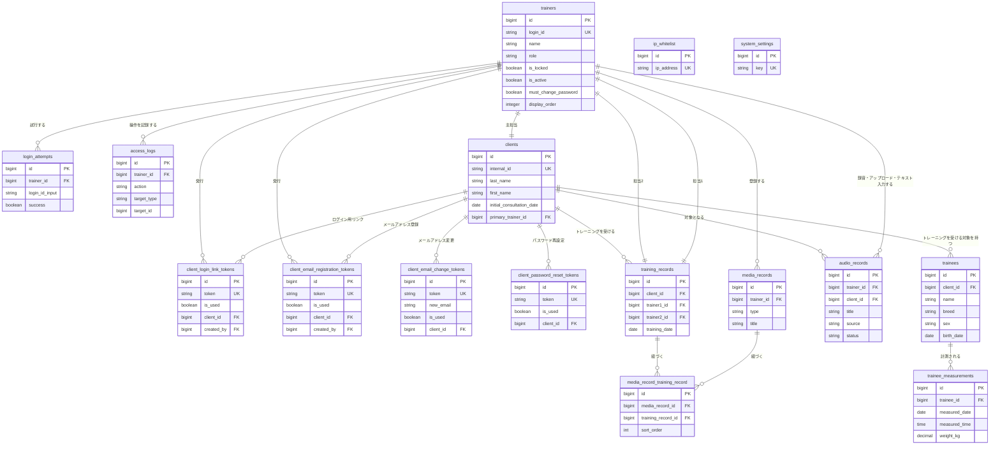

**位置づけ**: 仕様文書（DB設計書）
**対象読者**: 開発者
**上位文書**: requirements.md（6. 機能一覧、9. データ項目一覧）
**詳細**: 詳細は doc-index.md を参照

---

# DB設計書: トレーニング記録管理システム

## 1. データベース概要

- **DBMS**: MySQL 8.0
- **ストレージエンジン**: InnoDB（外部キー制約・トランザクションを活用するため）
- **文字セット**: utf8mb4
- **照合順序**: utf8mb4_unicode_ci。src/config/database.php の DB_COLLATION で指定し、マイグレーションで全テーブル・全カラムに明示的に適用する。日本語の五十音順ソートが必要な箇所では、クエリで COLLATE utf8mb4_ja_0900_as_cs を明示指定する
- **タイムゾーン**: Asia/Tokyo
- **命名規則**: テーブル名・カラム名はスネークケース（小文字＋アンダースコア）
- **ID生成**: BIGINT UNSIGNED AUTO_INCREMENT（Laravelの `$table->id()` を使用）
- **タイムスタンプ**: TIMESTAMP（Laravelの `$table->timestamps()` を使用）

---

## 2. ER図

※ER図はテーブル間の関連と主要カラム（主キー・ユニークキー・外部キー・主な業務識別/区分カラム）のみを示す。`created_at`/`updated_at`/`updated_by` 等の共通カラムおよび非識別カラムは省略しているため、全カラムは4章のテーブル定義を参照。clientsテーブルは7カテゴリー50業務項目＋共通カラムで構成され、ER図には代表カラムのみ掲載している。

---

## 3. 共通ルール

### 3-1. 主キー

主キーは原則として `id`（Laravel の `$table->id()` による BIGINT UNSIGNED の auto_increment）とする。テーブルの性質により異なる型を用いる場合がある。

### 3-2. 履歴情報

レコードの作成・更新を記録するため、必要に応じて以下のカラムを付与する。

- `created_at`（作成日時、TIMESTAMP）
- `updated_at`（更新日時、TIMESTAMP）
- `created_by`（作成者、BIGINT UNSIGNED、ログインID）
- `updated_by`（更新者、BIGINT UNSIGNED、ログインID）

### 3-3. 値の制限

コード値・選択肢・数値範囲などのカラムの値制限は、以下の二層構成で担保する。

- **DB の CHECK 制約（最終防壁）**: すべての値制限は DB の CHECK 制約として定義し、
  アプリを経由しない更新に対しても整合性を保証する。各テーブルの CHECK 制約は 4章に記載する。
- **アプリ側バリデーション（前段）**: ユーザーが直接入力するカラムについては、
  アプリ側のバリデーションを前段に置き、利用者に分かりやすいエラーを返す。

なお CHECK 制約は Laravel の schema builder では表現できないため、マイグレーション内で
`DB::statement` による生SQL（`ALTER TABLE ... ADD CONSTRAINT ... CHECK (...)`）で実装する。

---

## 4. テーブル定義

**記載する項目**: 各テーブルについて、以下の項目を記載する。
- **カラム定義**（必須）: カラム名・型・NULL・デフォルト・説明の5列で記載する。
- **インデックス**（必須）: インデックス名・カラム・種類・目的の4列で記載する。
- **制約**（必須）: 外部キー・CHECK 制約等。制約名・種類・条件・説明等で記載する。
- **注記**（任意）: カラム定義・インデックス・制約だけでは伝わりにくい設計上の補足がある場合に記載する。
- **設計ポリシー**（任意）: テーブル構造に関する設計判断の根拠を示す必要がある場合に記載する。

### 4-1. 業務データ

**記載範囲**:
- 本章では、本システムが提供するテーブル定義のうち、要件定義書（docs/requirements.md）の9章「データ項目一覧」で定義したテーブル定義を列挙する。

**参照ルール**:
- 各テーブルの業務的な意味・データ項目の業務仕様は、要件定義書（docs/requirements.md）の9章「データ項目一覧」で管理している。本書では同じテーブルID（D-0100 等）を使用しているため、テーブルIDで突き合わせて参照すること。
- 業務的な意味は要件定義書9章を正典とするため、本書では「概要」「対応する要件」は記載しない。

#### D-0100 clients（クライアント）

##### カラム定義

| カラム名 | 型 | NULL | デフォルト | 説明 |
|---------|-----|------|----------|------|
| id | BIGINT UNSIGNED | NO | auto_increment | 主キー |
| internal_id | VARCHAR(10) | NO | — | 内部ID（クライアント識別用）。新規登録時にシステムが自動採番。編集画面で手動変更可能。ユニーク制約あり |
| initial_consultation_date | DATE | NO | — | 初回日 |
| last_name | VARCHAR(50) | YES | NULL | 姓 |
| first_name | VARCHAR(50) | YES | NULL | 名 |
| last_name_kana | VARCHAR(50) | YES | NULL | せい。ひらがなのみ |
| first_name_kana | VARCHAR(50) | YES | NULL | めい。ひらがなのみ |
| primary_trainer_id | BIGINT UNSIGNED | YES | NULL | 主担当トレーナーのID（外部キー） |
| phone1 | VARCHAR(20) | YES | NULL | 電話番号。ハイフンあり/なし両対応 |
| phone2 | VARCHAR(20) | YES | NULL | 電話番号（予備）。ハイフンあり/なし両対応 |
| email | VARCHAR(255) | YES | NULL | メールアドレス。クライアント閲覧機能のログインIDを兼ねる。**クライアント自身がメールアドレス登録用 URL から登録する**（トレーナーは入力・書き換えできない）。UNIQUE制約あり（未登録=NULLは複数許容） |
| postal_code | VARCHAR(10) | YES | NULL | 郵便番号。ハイフンあり/なし両対応 |
| address1 | VARCHAR(50) | YES | NULL | 住所1（都道府県） |
| address2 | VARCHAR(50) | YES | NULL | 住所2（市区町村） |
| address3 | VARCHAR(100) | YES | NULL | 住所3（町名・番地） |
| address4 | VARCHAR(100) | YES | NULL | 住所4（建物名・部屋番号） |
| password | VARCHAR(255) | YES | NULL | クライアント閲覧機能のパスワードのハッシュ値（bcryptで暗号化）。**初回設定でクライアント本人が設定する**まで NULL |
| created_at | TIMESTAMP | YES | NULL | 作成日時 |
| updated_at | TIMESTAMP | YES | NULL | 更新日時 |
| updated_by | BIGINT UNSIGNED | YES | NULL | 最終更新者のトレーナーのID（外部キー） |

##### インデックス

| インデックス名 | カラム | 種類 | 目的 |
|---------------|--------|------|------|
| PRIMARY | id | PRIMARY KEY | 主キー |
| clients_internal_id_unique | internal_id | UNIQUE | 内部IDの重複を防ぐ。内部IDによる検索にも使用 |
| clients_initial_date_idx | initial_consultation_date | INDEX | 初回日によるソート・検索。一覧画面のデフォルトソートで使用 |
| clients_primary_trainer_idx | primary_trainer_id | INDEX | 主担当による検索 |
| clients_created_at_idx | created_at | INDEX | 登録日時によるソート |
| clients_updated_by_foreign | updated_by | INDEX | 最終更新者による検索。外部キー制約に伴い自動付与 |
| clients_email_unique | email | UNIQUE | メールアドレスの重複を防ぐ。クライアント閲覧機能のログインIDとして使用。未登録（NULL）は複数許容 |

##### 制約

| 制約名 | 種類 | 条件 | ON DELETE | 説明 |
|--------|------|------|-----------|------|
| clients_primary_trainer_id_foreign | FOREIGN KEY | primary_trainer_id → trainers(id) | SET NULL | トレーナー削除時は主担当をNULLにする |
| clients_updated_by_foreign | FOREIGN KEY | updated_by → trainers(id) | SET NULL | トレーナー削除時は最終更新者をNULLにする |

##### 備考

**クライアントの状態（メールアドレスなし／メールアドレス登録待ち／初回設定待ち／利用中）は、専用カラムを持たず導出値として扱う**。導出元は以下のとおり：

| 状態 | 判定 |
|------|------|
| 利用中 | `clients.password` が非 NULL |
| 初回設定待ち | `clients.email` が非 NULL かつ `clients.password` が NULL |
| メールアドレス登録待ち | `clients.email` が NULL かつ、対応する `client_email_registration_tokens` に `is_used = false` の行がある |
| メールアドレスなし | 上記のいずれにも当てはまらない |

**判定は上から順に評価し、最初に一致した状態を採用する**（複数条件が同時に成立し得るため順序が必要。特に「email あり かつ 有効な登録用 URL あり」のケースでは「初回設定待ち」を優先する）。

**期限切れの判定元は、常に `client_email_registration_tokens.expires_at`** とする（DS-0700）。ログイン用リンク（DS-0600 `client_login_link_tokens`）の `expires_at` は判定に使わない。理由は次のとおり：

- 全体の期限は登録用トークンの `expires_at` に集約されている（段階 4-1 で確定）
- 発行し直し直後はログイン用リンクが未生成（発行時に未使用のログイン用リンクを物理削除するため）で、判定基準にできない
- ログイン用リンクの `expires_at` は登録用トークンの `expires_at` を引き継ぐだけの派生値

有効期限切れの扱いを含む詳細な判定順序・クエリ例・表示規約は screen-design.md の S-0305 状態一覧を単一の正とする（本書と screen-design.md の間で表現が食い違った場合は screen-design.md を優先）。

---

#### D-0200 training_records（トレーニング記録）

##### カラム定義

| カラム名 | 型 | NULL | デフォルト | 説明 |
|---------|-----|------|----------|------|
| id | BIGINT UNSIGNED | NO | auto_increment | 主キー |
| client_id | BIGINT UNSIGNED | NO | — | クライアントのID（外部キー） |
| training_date | DATE | NO | — | トレーニング日（トレーニング記録の実施日）。呼び方は screen-design.md §2-6 参照。**マイグレーションのカラムコメント（`->comment('日付')`）は据置**（変更するには migration が必要で、コメントは画面に露出しないため実害がない） |
| training_time | TIME | YES | NULL | 時刻（トレーニング記録の実施時刻。HH:MM形式） |
| trainer1_id | BIGINT UNSIGNED | NO | — | 担当1のトレーナーのID（外部キー） |
| trainer2_id | BIGINT UNSIGNED | YES | NULL | 担当2のトレーナーのID（外部キー） |
| record_content | TEXT | YES | NULL | トレーナーからのノート（事実を客観的に記録、クライアント開示前提） |
| impression | TEXT | YES | NULL | 所感（トレーナー間共有、クライアント非開示） |
| created_at | TIMESTAMP | YES | NULL | 作成日時 |
| updated_at | TIMESTAMP | YES | NULL | 更新日時 |
| updated_by | BIGINT UNSIGNED | YES | NULL | 最終更新者のトレーナーのid（外部キー） |

##### インデックス

| インデックス名 | カラム | 種類 | 目的 |
|---------------|--------|------|------|
| PRIMARY | id | PRIMARY KEY | 主キー |
| training_records_client_date_idx | client_id, training_date | INDEX（複合） | クライアント別・日付順ソート。トレーニング履歴の時系列表示で使用。※Laravelマイグレーションの制約によりソート方向指定なし |
| training_records_date_idx | training_date | INDEX | 日付による検索・ソート |
| training_records_trainer1_idx | trainer1_id | INDEX | 担当1による検索 |
| training_records_trainer2_idx | trainer2_id | INDEX | 担当2による検索 |
| training_records_updated_by_foreign | updated_by | INDEX | 最終更新者による検索。外部キー制約に伴い自動付与 |

##### 制約

| 制約名 | 種類 | 条件 | ON DELETE | 説明 |
|--------|------|------|-----------|------|
| training_records_client_id_foreign | FOREIGN KEY | client_id → clients(id) | CASCADE | クライアント削除時にトレーニング記録も削除 |
| training_records_trainer1_id_foreign | FOREIGN KEY | trainer1_id → trainers(id) | RESTRICT | 担当1があるトレーナーは削除不可 |
| training_records_trainer2_id_foreign | FOREIGN KEY | trainer2_id → trainers(id) | SET NULL | 担当2が削除された場合はNULLにする |
| training_records_updated_by_foreign | FOREIGN KEY | updated_by → trainers(id) | SET NULL | トレーナー削除時は最終更新者をNULLにする |

---

#### D-0300 media_records（メディア）

##### カラム定義

| カラム名 | 型 | NULL | デフォルト | 説明 |
|---------|-----|------|----------|------|
| id | BIGINT UNSIGNED | NO | auto_increment | 主キー |
| trainer_id | BIGINT UNSIGNED | YES | NULL | アップロードしたトレーナーのID（外部キー）。登録者削除時はNULLになり、メディアはライブラリに残る |
| type | VARCHAR(20) | NO | — | メディア種別（5-17.参照） |
| title | VARCHAR(255) | YES | NULL | 表示名。未入力時は表示の際に元ファイル名（original_filename）をフォールバック表示する |
| original_filename | VARCHAR(255) | NO | — | アップロード時の元ファイル名 |
| original_path | VARCHAR(500) | NO | — | アップロードされた原本ファイルのオブジェクトストレージ上の保存パス（キー） |
| display_path | VARCHAR(500) | YES | NULL | ブラウザ表示用ファイルのオブジェクトストレージ上の保存パス（キー）。表示・再生にはこのパスを用いる |
| thumbnail_path | VARCHAR(500) | YES | NULL | サムネイルのオブジェクトストレージ上の保存パス（キー）。一覧表示に用いる |
| mime_type | VARCHAR(100) | NO | — | MIMEタイプ（image/jpeg, image/png, image/heic, video/mp4, video/quicktime 等） |
| file_size | BIGINT | YES | NULL | ファイルサイズ（バイト） |
| conversion_status | VARCHAR(20) | NO | 'not_required' | 表示用変換の状態（5-18.参照） |
| thumbnail_status | VARCHAR(20) | NO | 'pending' | サムネイル生成の状態（5-19.参照） |
| created_at | TIMESTAMP | YES | NULL | 登録日時 |
| updated_at | TIMESTAMP | YES | NULL | 最終更新日時 |

##### インデックス

| インデックス名 | カラム | 種類 | 目的 |
|---------------|--------|------|------|
| PRIMARY | id | PRIMARY KEY | 主キー |
| media_records_trainer_id_foreign | trainer_id | INDEX | 登録者別のメディア取得。一覧画面の登録者フィルタで使用（外部キー制約と兼用） |
| media_records_type_idx | type | INDEX | 種別（写真／動画）によるフィルタリング |
| media_records_created_at_idx | created_at | INDEX | 一覧画面で最新を先頭に表示するためのソート用（クエリ側で `ORDER BY created_at DESC`）。Laravelマイグレーションの制約によりインデックス方向指定なし |

##### 制約

| 制約名 | 種類 | 条件 | ON DELETE | 説明 |
|--------|------|------|-----------|------|
| media_records_trainer_id_foreign | FOREIGN KEY | trainer_id → trainers(id) | SET NULL | 登録者トレーナー削除時はNULLにする（メディアはライブラリに残す） |
| media_records_type_check | CHECK | type IN ('photo', 'video') | — | 定義済みのメディア種別のみ許可（5-17.参照） |
| media_records_file_size_check | CHECK | file_size IS NULL OR file_size >= 0 | — | ファイルサイズは0以上 |
| media_records_conversion_status_check | CHECK | conversion_status IN ('not_required', 'pending', 'processing', 'done', 'error') | — | 定義済みの変換状態のみ許可（5-18.参照） |
| media_records_thumbnail_status_check | CHECK | thumbnail_status IN ('pending', 'processing', 'done', 'error') | — | 定義済みのサムネイル状態のみ許可（5-19.参照） |

##### 注記

- **trainer_id の NULL 許容**: メディアはライブラリ型の独立資産であり、登録者トレーナーが削除されても実体（ファイル・レコード）は保持する。このため trainer_id は ON DELETE SET NULL とし、DB上は NULL を許容する。
- **ファイル実体との関係**: original_path / display_path / thumbnail_path はオブジェクトストレージ上のファイルへの参照であり、レコード削除時のファイル実体削除はアプリ側で行う（DBの外部キー制約はレコードのみを対象とし、ストレージ上のファイルには作用しない）。削除時は原本・表示用・サムネイルの全ファイルを対象とする。

##### 設計ポリシー

- **ライブラリ型**: メディアはトレーニング記録にも特定のクライアントにも従属せず、独立した素材ライブラリとして管理する。クライアント所有の概念を持たず（client_id を持たない）、1つのメディアを複数のクライアントのトレーニング記録に紐づけられる。トレーニング記録との紐付けは多対多の中間テーブル（D-0600 media_record_training_record）で表現し、本テーブル単体では記録への参照を持たない。

---

#### D-0600 media_record_training_record（トレーニング記録のメディア）

##### カラム定義

| カラム名 | 型 | NULL | デフォルト | 説明 |
|---------|-----|------|----------|------|
| id | BIGINT UNSIGNED | NO | auto_increment | 主キー |
| media_record_id | BIGINT UNSIGNED | NO | — | メディアのID（外部キー） |
| training_record_id | BIGINT UNSIGNED | NO | — | トレーニング記録のID（外部キー） |
| sort_order | INT UNSIGNED | NO | 0 | 同一トレーニング記録内でのメディアの表示順（0始まりの連番、昇順） |

##### インデックス

| インデックス名 | カラム | 種類 | 目的 |
|---------------|--------|------|------|
| PRIMARY | id | PRIMARY KEY | 主キー |
| mrtr_media_training_unique | media_record_id, training_record_id | UNIQUE（複合） | 同一メディアと同一記録の重複紐づけを防止 |
| mrtr_training_record_id_idx | training_record_id, sort_order | INDEX（複合） | トレーニング記録から紐づくメディアを表示順で取得（詳細・編集画面で使用）。※Laravelマイグレーションの制約によりソート方向指定なし |

##### 制約

| 制約名 | 種類 | 条件 | ON DELETE | 説明 |
|--------|------|------|-----------|------|
| mrtr_media_record_id_foreign | FOREIGN KEY | media_record_id → media_records(id) | CASCADE | メディア削除時に紐づけ行も削除 |
| mrtr_training_record_id_foreign | FOREIGN KEY | training_record_id → training_records(id) | CASCADE | トレーニング記録削除時に紐づけ行も削除 |

##### 注記

- **タイムスタンプを持たない**: 本テーブルは created_at / updated_at を持たない。Laravel の belongsToMany で `withTimestamps()` を付けない。紐づけの追加・解除・並べ替えに伴う日時・更新者は、親であるトレーニング記録（training_records）の updated_at / updated_by に反映する（処理の詳細は api-design.md を参照）。
- **sort_order は記録ごとに独立**: sort_order は中間テーブルの行が持つため、同一メディアが複数のトレーニング記録に紐づく場合でも、記録ごとに異なる表示順を持てる。値は同一 training_record 内で 0 始まりの連番とし、並べ替え時はその記録に紐づく全行を振り直す。新規追加したメディアは末尾に付ける（処理の詳細は api-design.md を参照）。

##### 設計ポリシー

- **関連の有無と表示順を保持**: 紐づけの追加・解除・並べ替えはトレーニング記録の編集（要件定義 6-4-5）の一部であり、紐づけが変わった事実は親トレーニング記録の更新として扱う。本テーブルは独自のタイムスタンプ・更新者を持たず、メディアと記録の関連の有無、および記録内での表示順（sort_order）を保持する。
- **CASCADE の意味**: メディアまたはトレーニング記録の実体が削除されたとき、その関連行も削除する。これは「紐づけ解除」（中間行のみを削除する編集操作）とは別であり、エンティティ実体の削除に伴う関連の消滅を指す。紐づけ解除はメディア・記録の実体に影響しない。

---

#### D-0400 audio_records（音声記録）

##### カラム定義

| カラム名 | 型 | NULL | デフォルト | 説明 |
|---------|-----|------|----------|------|
| id | BIGINT UNSIGNED | NO | auto_increment | 主キー |
| trainer_id | BIGINT UNSIGNED | NO | — | アップロード・録音・テキスト入力したトレーナーのID（外部キー） |
| client_id | BIGINT UNSIGNED | NO | — | 音声記録の対象となるクライアントのID（外部キー）。誤紐付け防止のため登録時必須 |
| title | VARCHAR(255) | NO | — | 表示名 |
| source | VARCHAR(20) | NO | — | 音声ソース種別（5-13.参照） |
| file_name | VARCHAR(255) | YES | NULL | 元のファイル名。テキスト貼り付け時は実体ファイルがないためNULL |
| file_path | VARCHAR(500) | YES | — | サーバー上の保存パス（storage/audio/ 以下の相対パス）。「音声ファイルを削除」実行時にNULLに設定される。テキスト貼り付けでは常にNULL |
| status | VARCHAR(20) | NO | 'unprocessed' | 音声処理状態（5-14.参照） |
| transcription_text | LONGTEXT | YES | NULL | 文字起こし結果。トレーナーが編集可能。テキスト貼り付け時はユーザーが入力したテキストを保存 |
| summary_text | LONGTEXT | YES | NULL | 要約結果。トレーナーが編集可能 |
| duration_seconds | INTEGER | YES | NULL | 音声の長さ（秒）。Whisper API処理時に取得。テキスト貼り付け時はNULL |
| file_size | BIGINT | YES | NULL | ファイルサイズ（バイト）。テキスト貼り付け時はNULL |
| summarized_at | TIMESTAMP | YES | NULL | 要約完了日時。要約処理が正常終了した時点で記録 |
| created_at | TIMESTAMP | YES | NULL | アップロード・録音・テキスト入力日時 |
| updated_at | TIMESTAMP | YES | NULL | 最終更新日時 |

##### インデックス

| インデックス名 | カラム | 種類 | 目的 |
|---------------|--------|------|------|
| PRIMARY | id | PRIMARY KEY | 主キー |
| audio_records_trainer_idx | trainer_id | INDEX | トレーナー別の音声記録取得。一般は自分の音声記録のみ表示（外部キー制約と兼用） |
| audio_records_status_idx | status | INDEX | 音声処理状態によるフィルタリング |
| audio_records_created_at_idx | created_at | INDEX | 一覧画面で最新を先頭に表示するためのソート用（クエリ側で `ORDER BY created_at DESC`）。Laravelマイグレーションの制約によりインデックス方向指定なし |
| audio_records_client_id_foreign | client_id | INDEX | クライアント別の音声記録取得（外部キー制約と兼用） |

##### 制約

| 制約名 | 種類 | 条件 | ON DELETE | 説明 |
|--------|------|------|-----------|------|
| audio_records_trainer_id_foreign | FOREIGN KEY | trainer_id → trainers(id) | CASCADE | トレーナー削除時に音声記録も削除 |
| audio_records_client_id_foreign | FOREIGN KEY | client_id → clients(id) | RESTRICT | クライアントが関連する音声記録を持つ場合は削除制限 |
| audio_records_source_check | CHECK | source IN ('recording', 'upload', 'text_paste') | — | 定義済みの音声ソース種別のみ許可（5-13.参照） |
| audio_records_status_check | CHECK | status IN ('unprocessed', 'transcribing', 'transcribed', 'summarizing', 'completed', 'error') | — | 定義済みのステータスのみ許可（5-14.参照） |
| audio_records_duration_check | CHECK | duration_seconds IS NULL OR duration_seconds >= 0 | — | 音声時間は0以上 |
| audio_records_file_size_check | CHECK | file_size IS NULL OR file_size >= 0 | — | ファイルサイズは0以上 |

---

#### D-0500 trainers（トレーナー）

##### カラム定義

| カラム名 | 型 | NULL | デフォルト | 説明 |
|---------|-----|------|----------|------|
| id | BIGINT UNSIGNED | NO | auto_increment | 主キー |
| display_order | INTEGER | NO | 0 | 表示順。小さい値ほど上位に表示される。トレーナー一覧やプルダウン選択肢の並び順に使用 |
| login_id | VARCHAR(50) | NO | — | ログインID。半角英数字とアンダースコアのみ |
| name | VARCHAR(100) | NO | — | トレーナーの名前 |
| role | VARCHAR(20) | NO | 'staff' | 権限（5-15.参照） |
| last_login_at | TIMESTAMP | YES | NULL | 最終ログイン日時 |
| password | VARCHAR(255) | NO | — | パスワードのハッシュ値（bcryptで暗号化、60文字固定） |
| is_locked | BOOLEAN | NO | false | アカウントロック状態。5回連続ログイン失敗、長期間未ログイン（初期値30日）、または発行後の未使用（初期値7日）で true になる（日数は `.env` で設定。バッチ設計書 1-2。**2026-10 変更**） |
| is_active | BOOLEAN | NO | true | アカウント有効フラグ。falseの場合ログイン不可 |
| must_change_password | BOOLEAN | NO | false | 初回ログイン時パスワード変更必須フラグ |
| created_at | TIMESTAMP | YES | NULL | 作成日時 |
| updated_at | TIMESTAMP | YES | NULL | 更新日時 |

##### インデックス

| インデックス名 | カラム | 種類 | 目的 |
|---------------|--------|------|------|
| PRIMARY | id | PRIMARY KEY | 主キー |
| trainers_login_id_unique | login_id | UNIQUE | ログインIDの重複を防ぐ。ログイン時の検索にも使用 |
| trainers_display_order_index | display_order | INDEX | 表示順でのソートを高速化 |

##### 制約

| 制約名 | 種類 | 条件 | 説明 |
|--------|------|------|------|
| trainers_role_check | CHECK | role IN ('system_admin', 'admin', 'staff') | 定義済みの権限のみ許可（5-15.参照） |
| trainers_login_id_check | CHECK | login_id REGEXP '^[a-zA-Z0-9_]+$' | 半角英数字とアンダースコアのみ |

---

#### DM-0200 training_types（トレーニング内容）

（2026-09 削除。欠番）ユーザーレビューでトレーナーが「トレーニング内容」の分類は不要と判断したため、テーブルごと廃止。マスタ ID は振り直さない。

---

#### D-0700 trainees（トレーニー）

##### カラム定義

| カラム名 | 型 | NULL | デフォルト | 説明 |
|---------|-----|------|----------|------|
| id | BIGINT UNSIGNED | NO | auto_increment | 主キー |
| client_id | BIGINT UNSIGNED | NO | — | 会員のID（外部キー） |
| name | VARCHAR(50) | NO | — | 名前。犬の名前はひらがな・カタカナが多く、よみ（かな）は持たない |
| breed | VARCHAR(100) | YES | NULL | 犬種。自由入力（「ミックス」等の表記に対応するためマスタは持たない） |
| sex | VARCHAR(20) | YES | NULL | 性別。値は 5-20. 参照 |
| birth_date | DATE | YES | NULL | 誕生日。保護犬等で正確な生年月日が不明な場合があるため NULL 許容（推定の場合は note に記載） |
| note | TEXT | YES | NULL | 備考 |
| photo_path | VARCHAR(500) | YES | NULL | トレーニーの写真のオブジェクトストレージ上の保存パス（キー）。写真未登録は NULL。**リサイズ済みの JPEG 1 枚のみ**（原寸・サムネイルは持たない）。詳細は下の注記「トレーニー写真の扱い」参照 |
| created_at | TIMESTAMP | YES | NULL | 作成日時 |
| updated_at | TIMESTAMP | YES | NULL | 更新日時 |
| updated_by | BIGINT UNSIGNED | YES | NULL | 最終更新者のトレーナーのid（外部キー）。**写真の登録・削除で会員が更新した場合は NULL のまま**（トレーナーによる更新の追跡カラムのため、会員操作では触らない。詳細は下の注記参照） |

##### インデックス

| インデックス名 | カラム | 種類 | 目的 |
|---------------|--------|------|------|
| PRIMARY | id | PRIMARY KEY | 主キー |
| trainees_client_id_idx | client_id | INDEX | 会員による検索・逆引き（会員詳細でのトレーニー一覧表示） |
| trainees_updated_by_foreign | updated_by | INDEX | 最終更新者による検索。外部キー制約に伴い自動付与 |

##### 制約

| 制約名 | 種類 | 条件 | ON DELETE | 説明 |
|--------|------|------|-----------|------|
| trainees_client_id_foreign | FOREIGN KEY | client_id → clients(id) | CASCADE | 会員削除時はトレーニーも削除。ただしアプリ側では**トレーニーが存在する会員の削除を拒否**する（既存のトレーニング記録と同じ二層構え。CASCADE は誤操作・整合性のための最終防壁） |
| trainees_updated_by_foreign | FOREIGN KEY | updated_by → trainers(id) | SET NULL | トレーナー削除時は最終更新者をNULLにする |
| trainees_sex_check | CHECK | sex IN ('male', 'female', 'unknown') | — | 性別の値制限（5-20. 参照） |

##### 注記

- `display_order` は持たない。複数頭は稀であり、並び順は登録順（`id` 昇順）とする
- 年齢カラムは持たない。`birth_date` から算出して表示する（`birth_date` が NULL のときは年齢表示なし）
- 将来的にトレーニングの対象を犬以外（人間等）に広げる可能性を見据え、テーブル名・カラム名は犬に限定しない命名としている。ただし `breed` は犬固有の項目であり、対象を広げる際は使用しないカラムとして残すか別テーブルへの切り出しを検討する
- `created_by` は持たない（`training_records` 等の既存テーブルと同様、`updated_by` のみ）
- **トレーニー写真の扱い**（2026-09 追加、要件定義書 6-15-15 参照）：
  - **保存先のキー形式は `trainees/YYYYMM/{uuid}.jpg` 固定**（YYYYMM はアップロード月）。既存の `media_records` は `media/YYYYMM/{uuid}.{ext}` を使うため、名前空間を分けることでバケット内で「トレーニー写真の実ファイル一覧」を接頭辞スキャンだけで取り出せる（監査・掃除の運用上の利点）。拡張子は常に `.jpg`（サーバ側で必ず JPEG に変換して保存するため）
  - **既存の `media_records`（D-0300）とは別の仕組みである**：`media_records` は「ライブラリ型」（`client_id` を持たず、トレーニング記録と多対多）の設計で、1 つの実ファイルを複数のトレーニング記録に紐づけられる。一方、トレーニー写真は「トレーニーに 1 枚・所有」の 1 対 1 関係で、記録の分類軸ではなくトレーニーの属性として扱う。既存の中間テーブル（`media_record_training_record`）に載せると「トレーニーというクライアント所有の概念」が `media_records` に流れ込み、ライブラリ型の設計方針を破ることになる。**別テーブルは作らず本テーブルにカラムとして持つ**理由は、1 対 1 で、状態遷移（変換状態・サムネイル状態）や複数バリアント（原本／表示用／サムネイル）を持たないため、独立テーブルにする利点がないため
  - **保存する実ファイルは 1 枚のみ**（原寸・サムネイルは持たない）。長辺 400px にリサイズ済みの JPEG を保存する。表示（S-1402 の 180px 四方の枠）に対して十分な解像度で、拡大表示の要件もないため、原本を残す必要がない。したがって `original_path` / `display_path` / `thumbnail_path` のように 3 カラム持たず、`photo_path` 1 本で足りる
  - **変換状態カラム（`conversion_status` / `thumbnail_status`）は持たない**：常に同期でリサイズ・JPEG 変換してから DB に書くため、pending 状態が存在しない。DB レコードに `photo_path` が入っていれば「その実ファイルは表示可能な状態」であることが常に成り立つ
  - **削除時**：会員が「削除」を実行するか、写真差し替え（同じトレーニーで再アップロード）で旧ファイルは対象。ファイルの実削除は既存 `MediaRecordController::destroy` と同型で「ファイル先削除 → DB カラムを NULL 化」の順とする（アプリ側の責務。DB の外部キー制約はストレージ上のファイルには作用しない）

---

#### D-0800 trainee_measurements（トレーニー計測値）

##### カラム定義

| カラム名 | 型 | NULL | デフォルト | 説明 |
|---------|-----|------|----------|------|
| id | BIGINT UNSIGNED | NO | auto_increment | 主キー |
| trainee_id | BIGINT UNSIGNED | NO | — | トレーニーのID（外部キー） |
| measured_date | DATE | NO | — | 計測日 |
| measured_time | TIME | NO | — | 計測時刻（HH:MM形式）。1日2回の計測に対応するため保持し、**NOT NULL とする**（NULL を許容するとユニーク制約が機能しないため） |
| weight_kg | DECIMAL(5,2) | NO | — | 体重（kg） |
| created_at | TIMESTAMP | YES | NULL | 作成日時 |
| updated_at | TIMESTAMP | YES | NULL | 更新日時 |
| updated_by | BIGINT UNSIGNED | YES | NULL | 最終更新者のトレーナーのid（外部キー） |

##### インデックス

| インデックス名 | カラム | 種類 | 目的 |
|---------------|--------|------|------|
| PRIMARY | id | PRIMARY KEY | 主キー |
| trainee_measurements_trainee_date_unique | trainee_id, measured_date, measured_time | UNIQUE（複合） | 同一トレーニー・同一日時の二重登録を防ぐ。時系列の検索・ソートにも使用 |
| trainee_measurements_updated_by_foreign | updated_by | INDEX | 最終更新者による検索。外部キー制約に伴い自動付与 |

##### 制約

| 制約名 | 種類 | 条件 | ON DELETE | 説明 |
|--------|------|------|-----------|------|
| trainee_measurements_trainee_id_foreign | FOREIGN KEY | trainee_id → trainees(id) | CASCADE | トレーニー削除時は計測値も削除（計測値は日々増えるため削除拒否方式は採らない） |
| trainee_measurements_updated_by_foreign | FOREIGN KEY | updated_by → trainers(id) | SET NULL | トレーナー削除時は最終更新者をNULLにする |
| trainee_measurements_weight_kg_check | CHECK | weight_kg > 0 AND weight_kg <= 999.99 | — | 体重の値制限（正値、`DECIMAL(5,2)` の上限） |

##### 設計ポリシー

- **計測項目は横持ち（項目ごとにカラム）とする**。現状の計測項目は体重のみ。将来項目が増える可能性はあるが、内容が未知であり数値以外になる可能性もあるため、項目マスタ＋値カラムの縦持ち方式は採らない（縦持ちにすると値カラムの型を固定できず、入力検証と集計が破綻する）。項目追加時はカラム追加で対応する
- 計測は `training_records` とは紐付けない独立データとする。トレーニング記録と突き合わせて表示する必要が生じた場合は日付で結合する

---

### 4-2. システム定義データ

**記載範囲**:
- 本章では、本システムが提供するテーブル定義のうち、要件定義書（docs/requirements.md）の9章「データ項目一覧」で定義されていない、システムが定義するテーブル定義を列挙する。

**記載項目（4-2 固有）**:
- 各テーブルの冒頭に以下を記載する。
  - **概要**: テーブルの役割を1〜2文で示す。
  - **対応する要件**: このテーブルが支える機能・要件を挙げる。
- カラム定義・インデックス・制約・注記・設計ポリシーは 4章冒頭の共通ルールに従う。

#### DS-0100 system_settings（システム設定）

**概要**: システム全体の設定をキー・バリュー形式で管理する

**対応する要件**: 
- IPアドレス制限
- 要約プロンプト設定

##### カラム定義

| カラム名 | 型 | NULL | デフォルト | 説明 |
|---------|-----|------|----------|------|
| id | BIGINT UNSIGNED | NO | auto_increment | 主キー |
| key | VARCHAR(50) | NO | — | 設定キー。小文字スネークケース |
| value | TEXT | YES | NULL | 設定値 |
| created_at | TIMESTAMP | YES | NULL | 作成日時 |
| updated_at | TIMESTAMP | YES | NULL | 最終更新日時 |

##### インデックス

| インデックス名 | カラム | 種類 | 目的 |
|---------------|--------|------|------|
| PRIMARY | id | PRIMARY KEY | 主キー |
| system_settings_key_unique | key | UNIQUE | 設定キーの重複を防ぐ。キーによる検索にも使用 |

##### 制約

| 制約名 | 種類 | 条件 | 説明 |
|--------|------|------|------|
| system_settings_key_check | CHECK | key REGEXP '^[a-z][a-z0-9_]*$' | 設定キーはスネークケースのみ |

---

#### DS-0300 login_attempts（ログイン試行記録）

**概要**: ログインの試行を記録し、アカウントロック機能を実現する

**対応する要件**:
- ログイン
- アカウントの自動ロック

##### カラム定義

| カラム名 | 型 | NULL | デフォルト | 説明 |
|---------|-----|------|----------|------|
| id | BIGINT UNSIGNED | NO | auto_increment | 主キー |
| trainer_id | BIGINT UNSIGNED | YES | NULL | トレーナーのID（外部キー）。存在しないユーザーIDでの試行はNULL |
| login_id_input | VARCHAR(50) | NO | — | 入力されたログインID。存在しないIDでの試行も記録するため別カラムで保持 |
| ip_address | VARCHAR(45) | YES | NULL | 接続元IPアドレス。セキュリティ監査用 |
| attempted_at | TIMESTAMP | NO | CURRENT_TIMESTAMP | 試行日時 |
| success | BOOLEAN | NO | — | 成功（true）/ 失敗（false） |

##### インデックス

| インデックス名 | カラム | 種類 | 目的 |
|---------------|--------|------|------|
| PRIMARY | id | PRIMARY KEY | 主キー |
| login_attempts_trainer_idx | trainer_id, attempted_at | INDEX（複合） | 直近の連続失敗回数を効率的にカウント。アカウントロック判定で使用（クエリ側で `ORDER BY attempted_at DESC` を指定）。Laravelマイグレーションの制約によりインデックス方向指定なし |

##### 制約

| 制約名 | 種類 | 条件 | ON DELETE | 説明 |
|--------|------|------|-----------|------|
| login_attempts_trainer_id_foreign | FOREIGN KEY | trainer_id → trainers(id) | SET NULL | トレーナー削除時はNULLにする（試行記録は残す） |

---

#### DS-0400 ip_whitelist（IPホワイトリスト）

**概要**: IPアドレス制限で許可するIPアドレスをリスト管理する。各エントリに備考（拠点名等）を付与できる

**対応する要件**: 
- IPアドレス制限

##### カラム定義

| カラム名 | 型 | NULL | デフォルト | 説明 |
|---------|-----|------|----------|------|
| id | BIGINT UNSIGNED | NO | auto_increment | 主キー |
| ip_address | VARCHAR(45) | NO | — | IPアドレス。IPv4単一アドレスまたはCIDR形式（例: 192.168.1.0/24） |
| description | VARCHAR(100) | YES | NULL | 備考（拠点名等。例: ○○オフィス） |
| created_at | TIMESTAMP | YES | NULL | 作成日時 |
| updated_at | TIMESTAMP | YES | NULL | 更新日時 |

##### インデックス

| インデックス名 | カラム | 種類 | 目的 |
|---------------|--------|------|------|
| PRIMARY | id | PRIMARY KEY | 主キー |
| ip_whitelist_ip_address_unique | ip_address | UNIQUE | IPアドレスの重複を防ぐ |

##### 制約

該当なし

---

#### DS-0500 access_logs（アクセスログ）

**概要**: トレーナーの操作履歴を記録する

**対応する要件**: 
- トレーナー操作履歴

##### カラム定義

| カラム名 | 型 | NULL | デフォルト | 説明 |
|---------|-----|------|----------|------|
| id | BIGINT UNSIGNED | NO | auto_increment | 主キー |
| trainer_id | BIGINT UNSIGNED | NO | — | トレーナーのID（外部キー） |
| action | VARCHAR(100) | NO | — | 操作種別（5-16.参照） |
| target_type | VARCHAR(50) | YES | NULL | 対象モデル名（Client, TrainingRecord 等） |
| target_id | BIGINT UNSIGNED | YES | NULL | 対象レコードID |
| ip_address | VARCHAR(45) | YES | NULL | 接続元IPアドレス |
| user_agent | VARCHAR(500) | YES | NULL | ブラウザ情報 |
| created_at | TIMESTAMP | YES | NULL | 作成日時 |
| updated_at | TIMESTAMP | YES | NULL | 更新日時 |

##### インデックス

| インデックス名 | カラム | 種類 | 目的 |
|---------------|--------|------|------|
| PRIMARY | id | PRIMARY KEY | 主キー |
| access_logs_trainer_id_created_at_idx | trainer_id, created_at | INDEX | トレーナー別・日時順の検索 |
| access_logs_action_created_at_idx | action, created_at | INDEX | アクション別・日時順の検索 |

##### 制約

| 制約名 | 種類 | 条件 | ON DELETE | 説明 |
|--------|------|------|-----------|------|
| access_logs_trainer_id_foreign | FOREIGN KEY | trainer_id → trainers(id) | CASCADE | トレーナー削除時にログも削除 |

---

#### DS-0600 client_login_link_tokens（クライアントログイン用リンクトークン）

**概要**: クライアントがメールアドレスを登録した際、当該アドレスに送信するログイン用リンクのトークンを管理する。リンクを開くとクライアントは自動ログインされ、初回設定画面（S-1403）に遷移する。

**対応する要件**:
- クライアントメールアドレス登録（6-15-4）
- クライアント初回設定（6-15-5）

##### カラム定義

| カラム名 | 型 | NULL | デフォルト | 説明 |
|---------|-----|------|----------|------|
| id | BIGINT UNSIGNED | NO | auto_increment | 主キー |
| token | VARCHAR(64) | NO | — | `Str::random(32)` で生成された 32 文字のランダム英数字（URLに埋め込む）。カラム型 VARCHAR(64) は将来の長さ拡張に備えた余裕。重複不可 |
| client_id | BIGINT UNSIGNED | NO | — | ログイン対象のクライアントID（外部キー）。発行時から特定のクライアントに紐づく |
| expires_at | TIMESTAMP | NO | — | 有効期限。**対応するメールアドレス登録用トークン（DS-0700 `client_email_registration_tokens`）の `expires_at` をそのまま引き継ぐ**（発行時点から数え直さない）。全体の期限はメールアドレス登録用 URL の発行時に決まる（設定値は `architecture.md` §3-1 参照） |
| is_used | BOOLEAN | NO | false | 使用状態。false: 未使用 / true: 使用済み。初回設定完了時に true に更新 |
| created_at | TIMESTAMP | YES | NULL | 発行日時 |
| updated_at | TIMESTAMP | YES | NULL | 更新日時 |
| created_by | BIGINT UNSIGNED | YES | NULL | トークンを発行した（メールアドレス登録用 URL を発行した）トレーナーのID（外部キー） |

##### インデックス

| インデックス名 | カラム | 種類 | 目的 |
|---------------|--------|------|------|
| PRIMARY | id | PRIMARY KEY | 主キー |
| client_login_link_tokens_token_unique | token | UNIQUE | トークン文字列の重複を防ぐ。URLアクセス時の検索にも使用 |
| client_login_link_tokens_expires_at_idx | expires_at | INDEX | 有効期限による検索・期限切れ抽出 |
| client_login_link_tokens_is_used_idx | is_used | INDEX | 使用状態による絞り込み |
| client_login_link_tokens_client_id_idx | client_id | INDEX | クライアントによる検索・逆引き |
| client_login_link_tokens_created_by_idx | created_by | INDEX | 発行者による検索・絞り込み |

##### 制約

| 制約名 | 種類 | 条件 | ON DELETE | 説明 |
|--------|------|------|-----------|------|
| client_login_link_tokens_client_id_foreign | FOREIGN KEY | client_id → clients(id) | CASCADE | クライアント削除時はトークンも削除する（特定クライアント専用のトークンのため） |
| client_login_link_tokens_created_by_foreign | FOREIGN KEY | created_by → trainers(id) | SET NULL | 発行者トレーナー削除時は NULL にする |

---

#### DS-0700 client_email_registration_tokens（クライアントメールアドレス登録トークン）

**概要**: トレーナーがクライアントに渡す、メールアドレス登録用 URL のトークンを管理する。クライアントはこの URL からメールアドレスを登録し、当該アドレスに DS-0600 のログイン用リンクが送信される。

**対応する要件**:
- メールアドレス登録用 URL の発行（6-3-6）
- クライアントメールアドレス登録（6-15-4）

##### カラム定義

| カラム名 | 型 | NULL | デフォルト | 説明 |
|---------|-----|------|----------|------|
| id | BIGINT UNSIGNED | NO | auto_increment | 主キー |
| token | VARCHAR(64) | NO | — | `Str::random(32)` で生成された 32 文字のランダム英数字（URLに埋め込む）。カラム型 VARCHAR(64) は将来の長さ拡張に備えた余裕。重複不可 |
| client_id | BIGINT UNSIGNED | NO | — | メールアドレス登録の対象クライアントのID（外部キー）。発行時から特定のクライアントに紐づく |
| expires_at | TIMESTAMP | NO | — | 有効期限。**発行から 3 日後**に設定される（設定値は `architecture.md` §3-1 参照）。**この期限が初回設定完了までの全体の期限**となり、対応するログイン用リンク（DS-0600）にもそのまま引き継がれる |
| is_used | BOOLEAN | NO | false | 使用状態。false: 未使用 / true: 使用済み。**初回設定が完了した時点で true に更新**（メールアドレス登録単独では使用済みにしない — 何度でも入力し直せるため） |
| created_at | TIMESTAMP | YES | NULL | 発行日時 |
| updated_at | TIMESTAMP | YES | NULL | 更新日時 |
| created_by | BIGINT UNSIGNED | YES | NULL | トークンを発行したトレーナーのID（外部キー） |

##### インデックス

| インデックス名 | カラム | 種類 | 目的 |
|---------------|--------|------|------|
| PRIMARY | id | PRIMARY KEY | 主キー |
| client_email_registration_tokens_token_unique | token | UNIQUE | トークン文字列の重複を防ぐ。URLアクセス時の検索にも使用 |
| client_email_registration_tokens_expires_at_idx | expires_at | INDEX | 有効期限による検索・期限切れ抽出 |
| client_email_registration_tokens_is_used_idx | is_used | INDEX | 使用状態による絞り込み |
| client_email_registration_tokens_client_id_idx | client_id | INDEX | クライアントによる検索・逆引き |
| client_email_registration_tokens_created_by_idx | created_by | INDEX | 発行者による検索・絞り込み |

##### 制約

| 制約名 | 種類 | 条件 | ON DELETE | 説明 |
|--------|------|------|-----------|------|
| client_email_registration_tokens_client_id_foreign | FOREIGN KEY | client_id → clients(id) | CASCADE | クライアント削除時はトークンも削除する（特定クライアント専用のトークンのため） |
| client_email_registration_tokens_created_by_foreign | FOREIGN KEY | created_by → trainers(id) | SET NULL | 発行者トレーナー削除時は NULL にする |

**備考**:
- DS-0200 は段階 1 の事前入力 URL 廃止で欠番化しているため、新しい番号として DS-0700 を採る（既存の番号は繰り上げない）
- 本テーブルの `expires_at` が初回設定完了までの全体の期限を決める。ログイン用リンク（DS-0600）はこの期限を引き継ぎ、独立した期限を持たない（お客様の操作で期限が延びない設計）

---

#### DS-0800 client_email_change_tokens（クライアントメールアドレス変更トークン）

**概要**: ログイン中のお客様がメールアドレス変更画面（S-1409）からメールアドレスを変更する際、新しいアドレス宛に送る**メールアドレス確認リンク**のトークンを管理する。お客様がリンクを開いた時点で `clients.email` を切り替えるとともに、切替後に自動ログアウトして S-1401 クライアントログイン画面へ遷移する。

**対応する要件**:
- メールアドレスの変更（6-15-10）

##### カラム定義

| カラム名 | 型 | NULL | デフォルト | 説明 |
|---------|-----|------|----------|------|
| id | BIGINT UNSIGNED | NO | auto_increment | 主キー |
| token | VARCHAR(64) | NO | — | `Str::random(32)` で生成された 32 文字のランダム英数字（URLに埋め込む）。カラム型 VARCHAR(64) は将来の長さ拡張に備えた余裕。重複不可 |
| client_id | BIGINT UNSIGNED | NO | — | 変更対象クライアントのID（外部キー）。申し込みを行ったクライアント |
| new_email | VARCHAR(255) | NO | — | **確認後に切り替える新しいメールアドレス**。確認までは `clients.email` を書き換えず、このカラムで保持する。切替直前に `clients.email` の重複を再確認するため、`clients.email` と同じ長さ・文字集合とする |
| expires_at | TIMESTAMP | NO | — | 有効期限。**発行から 3 日後**に設定される（設定値は `architecture.md` §3-1 の `client_tokens.email_change_confirm_expires_days` を参照）。**他のトークン（DS-0600 / DS-0700）とは無関係に発行されるため、独立した有効期限を持つ**（引き継ぐ元がない） |
| is_used | BOOLEAN | NO | false | 使用状態。false: 未使用 / true: 使用済み。リンクを開いてメールアドレスの切替が完了した時点で true に更新 |
| created_at | TIMESTAMP | YES | NULL | 発行日時 |
| updated_at | TIMESTAMP | YES | NULL | 更新日時 |

##### インデックス

| インデックス名 | カラム | 種類 | 目的 |
|---------------|--------|------|------|
| PRIMARY | id | PRIMARY KEY | 主キー |
| client_email_change_tokens_token_unique | token | UNIQUE | トークン文字列の重複を防ぐ。URLアクセス時の検索にも使用 |
| client_email_change_tokens_expires_at_idx | expires_at | INDEX | 有効期限による検索・期限切れ抽出 |
| client_email_change_tokens_is_used_idx | is_used | INDEX | 使用状態による絞り込み |
| client_email_change_tokens_client_id_idx | client_id | INDEX | クライアントによる検索・逆引き |

##### 制約

| 制約名 | 種類 | 条件 | ON DELETE | 説明 |
|--------|------|------|-----------|------|
| client_email_change_tokens_client_id_foreign | FOREIGN KEY | client_id → clients(id) | CASCADE | クライアント削除時はトークンも削除する（特定クライアント専用のトークンのため） |

**備考**:
- `created_by` カラムは持たない（発行者はクライアント本人であり、他のトークン（DS-0600 / DS-0700）と異なりトレーナーからは発行されないため）
- `new_email` を保持する専用カラムを設ける理由：**確認されるまでは `clients.email` を書き換えない**という要件（6-15-10）を素直に表現するため。ログイン中のクライアントは古いアドレスのままログイン可能な状態を維持し、確認完了で切替 → ログアウト → 新アドレスでログインの流れが成立する
- **`new_email` に UNIQUE 制約は付けない**。同一クライアントが同じ宛先で複数回試すことがあり得るのと、切替の直前に `clients.email` 側で重複を再チェックするためこちらでは制約を設けない
- 独立した有効期限を持つ設計上、`architecture.md` §3-1 の設定値も独立キー（`client_tokens.email_change_confirm_expires_days`）で管理する

---

#### DS-0900 client_password_reset_tokens（クライアントパスワード再設定トークン）

**概要**: パスワードを忘れたお客様が、ログイン画面（S-1401）の「パスワードを忘れた方」から申し込みを行った際、当該お客様の登録アドレス宛に送る**パスワード再設定リンク**のトークンを管理する。お客様がリンクを開くとパスワード再設定画面（S-1408）へ遷移し、新しいパスワードを設定するとログイン画面（S-1401）へ戻る（そのままログインさせない）。

**対応する要件**:
- パスワードの再設定（6-15-12）

##### カラム定義

| カラム名 | 型 | NULL | デフォルト | 説明 |
|---------|-----|------|----------|------|
| id | BIGINT UNSIGNED | NO | auto_increment | 主キー |
| token | VARCHAR(64) | NO | — | `Str::random(32)` で生成された 32 文字のランダム英数字（URLに埋め込む）。カラム型 VARCHAR(64) は将来の長さ拡張に備えた余裕。重複不可 |
| client_id | BIGINT UNSIGNED | NO | — | 再設定対象クライアントのID（外部キー）。申し込み時に「利用中」だったクライアント |
| expires_at | TIMESTAMP | NO | — | 有効期限。**発行から 3 日後**に設定される（設定値は `architecture.md` §3-1 の `client_tokens.password_reset_expires_days` を参照）。**他のトークン（DS-0600 / DS-0700 / DS-0800）とは無関係に発行されるため、独立した有効期限を持つ**（引き継ぐ元がない） |
| is_used | BOOLEAN | NO | false | 使用状態。false: 未使用 / true: 使用済み。パスワード再設定が完了した時点で true に更新 |
| created_at | TIMESTAMP | YES | NULL | 発行日時 |
| updated_at | TIMESTAMP | YES | NULL | 更新日時 |

##### インデックス

| インデックス名 | カラム | 種類 | 目的 |
|---------------|--------|------|------|
| PRIMARY | id | PRIMARY KEY | 主キー |
| client_password_reset_tokens_token_unique | token | UNIQUE | トークン文字列の重複を防ぐ。URLアクセス時の検索にも使用 |
| client_password_reset_tokens_expires_at_idx | expires_at | INDEX | 有効期限による検索・期限切れ抽出 |
| client_password_reset_tokens_is_used_idx | is_used | INDEX | 使用状態による絞り込み |
| client_password_reset_tokens_client_id_idx | client_id | INDEX | クライアントによる検索・逆引き |

##### 制約

| 制約名 | 種類 | 条件 | ON DELETE | 説明 |
|--------|------|------|-----------|------|
| client_password_reset_tokens_client_id_foreign | FOREIGN KEY | client_id → clients(id) | CASCADE | クライアント削除時はトークンも削除する（特定クライアント専用のトークンのため） |

**備考**:
- `created_by` カラムは持たない（発行者はお客様本人。申し込み時点で認証済みではないが、メールアドレスから特定される。他のトークン（DS-0600 / DS-0700）と異なりトレーナーからは発行されないため）
- **新しいメールアドレスを保持するカラムは持たない**（DS-0800 と異なり、パスワード再設定ではメールアドレスは変わらないため）
- **`token` 以外の一意制約は付けない**。同一クライアントが同時に有効な再設定リンクを 1 本だけ持つ制約は、コントローラで「未使用のトークンを物理削除してから新規発行」する運用で担保する（DS-0800 と同じ考え方）
- 独立した有効期限を持つ設計上、`architecture.md` §3-1 の設定値も独立キー（`client_tokens.password_reset_expires_days`）で管理する

---

## 5. ENUMおよび定数

### 5-13. 音声ソース種別

| 値 | 説明 |
|----|------|
| recording | 録音。録音機能で音声を録音して作成されたレコード |
| upload | アップロード。音声ファイルのアップロード機能で作成されたレコード |
| text_paste | テキスト貼り付け。文字起こしテキストを直接入力して作成されたレコード |

### 5-14. 音声処理状態

| 値 | 説明 |
|----|------|
| unprocessed | 文字起こし待ち。録音・アップロード直後の状態 |
| transcribing | 文字起こし中。Whisper APIで処理を同期実行している状態 |
| transcribed | 要約待ち。文字起こし完了済み、要約の実行が可能な状態 |
| summarizing | 要約中。Claude APIで処理を同期実行している状態 |
| completed | 要約完了。文字起こし・要約がすべて完了した状態 |
| error | エラー。文字起こしまたは要約の処理中にエラーが発生した状態 |

### 5-15. トレーナー権限

| 値 | 説明 |
|----|------|
| staff | 一般。業務機能のみ可能 |
| admin | 管理者。業務機能と業務管理機能が可能。システム管理機能は不可 |
| system_admin | システム管理者。システム管理機能のみ可能。クライアント・トレーニング記録へのアクセス不可。無効化・削除不可、ロック対象外 |

### 5-16. 操作種別

| 値 | 説明 |
|----|------|
| login | ログイン |
| logout | ログアウト |
| view_client | クライアント詳細（参照） |
| create_client | クライアント登録 |
| edit_client | クライアント編集 |
| delete_client | クライアント削除 |
| view_training_record | トレーニング記録詳細（参照） |
| create_training_record | トレーニング記録登録 |
| edit_training_record | トレーニング記録編集 |
| delete_training_record | トレーニング記録削除 |
| create_trainee | トレーニー登録 |
| edit_trainee | トレーニー編集 |
| delete_trainee | トレーニー削除 |
| create_trainee_measurement | トレーニー計測値登録 |
| edit_trainee_measurement | トレーニー計測値編集 |
| delete_trainee_measurement | トレーニー計測値削除 |

`target_type` には短縮クラス名を格納する（例：会員は `'Client'`、トレーニング記録は `'TrainingRecord'`、トレーニーは `'Trainee'`、計測値は `'TraineeMeasurement'`）。トレーニーは詳細画面が会員詳細（S-0305）内に置かれるため、参照の操作種別（`view_trainee`）は持たない（トレーニーの参照は `view_client` に含める。計測値も同様）。

### 5-17. メディア種別

| 値 | 説明 |
|----|------|
| photo | 写真。jpeg / png / heic 形式の画像 |
| video | 動画。mp4 / mov 形式の動画 |

### 5-18. メディア変換状態

| 値 | 説明 |
|----|------|
| not_required | 変換不要。jpeg / png / mp4 形式で、原本がそのままブラウザ表示・再生可能な状態 |
| pending | 変換待ち。heic / mov 形式で、表示用ファイルへの変換が必要だが未実行の状態 |
| processing | 変換中。表示用ファイルへの変換処理を実行している状態 |
| done | 変換完了。表示用ファイルが生成され、display_path に保存された状態 |
| error | エラー。変換処理中にエラーが発生した状態 |

### 5-19. メディアサムネイル状態

| 値 | 説明 |
|----|------|
| pending | 生成待ち。サムネイルの生成が未実行の状態 |
| processing | 生成中。サムネイルの生成処理を実行している状態 |
| done | 生成完了。サムネイルが生成され、thumbnail_path に保存された状態 |
| error | エラー。サムネイル生成処理中にエラーが発生した状態 |

### 5-20. 性別

D-0700 `trainees.sex` の値。犬以外への対象拡張時にも共通で使えるよう、値は「male / female / unknown」の 3 値とする。日本語表示は画面設計書に委ねる（男の子／女の子／不明）。

| 値 | 説明 |
|----|------|
| male | 男の子 |
| female | 女の子 |
| unknown | 不明。保護犬等で性別が不明な場合、または未確認の場合 |

> **表示の文言の変更（2026-10）**：お客様（ドッグトレーナー）の要望により、画面に出す性別の文言を「オス／メス」から「男の子／女の子」に変更した。DB に保存する値（`male` / `female` / `unknown`）は変えておらず、Blade からは `Trainee::sexLabels()` の 1 か所で対応表を参照する。

---

## 6. マイグレーション

### 6-1. 基本ルール

- **マイグレーションツール**: Laravel Artisan migrate（Laravel標準）
- **マイグレーションファイルの保管場所**: `src/database/migrations/`
- **命名規則**: Laravelのデフォルト（`YYYY_MM_DD_HHMMSS_description.php`）
- **ロールバック**: すべてのマイグレーションに `down()` メソッドを定義し、ロールバック可能にする

### 6-2. テーブルの依存順序

本システムが定義する業務テーブルを、依存関係を考慮した論理順序（設計上の整理順）で示す。
依存を持たないテーブルを先に、依存するテーブルを後に並べている。

> **正典について**: 実際のマイグレーションファイルは `src/database/migrations/` を正典とする。
> 本表はテーブルの依存構造を俯瞰するためのものであり、個別ファイル名やカラム追加・変更の履歴は
> 列挙しない（それらは git の履歴を参照する）。
>
> **実行順について**: `php artisan migrate` は **ファイル名の辞書順** で実行される。
> そのため論理順（本表）と実行順は乖離するが、依存先テーブルを必要とするマイグレーションは
> すべて依存先より後のタイムスタンプを持つため、実行順でも依存解決上の問題は発生しない。
>
> **Laravel標準テーブルについて**: sessions / jobs / cache / failed_jobs などの
> Laravel標準テーブルは本表に含めない。

| 順序 | テーブル | 依存先 |
|:----:|----------|--------|
| 1 | trainers | なし |
| 2 | login_attempts | trainers |
| 3 | clients | trainers |
| 5 | training_records | clients, trainers |
| 6 | media_records | trainers |
| 7 | media_record_training_record | media_records, training_records |
| 8 | audio_records | clients, trainers |
| 9 | access_logs | trainers |
| 10 | system_settings | なし |
| 11 | ip_whitelist | なし |
| 12 | client_login_link_tokens | clients |
| 13 | client_email_registration_tokens | clients |
| 14 | client_email_change_tokens | clients |
| 15 | client_password_reset_tokens | clients |
| 16 | trainees | clients, trainers |
| 17 | trainee_measurements | trainees, trainers |

---

## 7. シードデータ（初期データ）

### 7-1. シーダーファイル一覧

| ファイル名 | 内容 | 実行タイミング |
|-----------|------|---------------|
| `DatabaseSeeder.php` | 全シーダーの呼び出し元。**`TrainerSeeder` / `SystemSettingSeeder` の 2 種を順に実行する**（`ClientSeeder` は本番では実行しないため呼び出し対象外） | `php artisan db:seed` |
| `TrainerSeeder.php` | 初期トレーナー **2 名**（システム管理者 1 名 + 管理者 1 名。詳細は 7.2.1 参照） | 本番／開発の初回セットアップ時 |
| `SystemSettingSeeder.php` | システム設定の初期データ（7.2.4参照） | 本番／開発の初回セットアップ時 |
| `ClientSeeder.php` | 開発環境用のサンプルクライアント 1 件。**`DatabaseSeeder` からは呼ばれない**。開発環境でクライアントログインの動作確認等が必要なとき、`php artisan db:seed --class=ClientSeeder` として明示実行する | 開発時に必要に応じて |
| `TrainingRecordDemoSeeder.php` | 開発・デモ用のトレーニング記録 18 件（クライアントポータル検証用）。`DatabaseSeeder` からは呼ばれない。**本番実行禁止** | 開発・デモ検証時のみ |

### 7-2. シードデータ（初期データ）の詳細

#### D-0500 trainers（トレーナー）

| login_id | display_order | name | role | password | 備考 |
|---------|---------------|------|------|----------|------|
| system_admin | 0 | システム管理者 | system_admin | シーダー内の固定値 | システム管理者（設定操作のみ）。開発・本番とも同じ固定値を使用（デプロイ後、必要ならシステム管理者本人が `password.change` から変更する） |
| （トレーナー本人の login_id） | 1 | （トレーナー本人の氏名） | admin | ランダム生成（誰も知らない） | **管理者（トレーナー本人のアカウント）**。運用開始時にシステム管理者が `trainers.reset-password` からパスワードをリセットして本人に伝える |

**運用時の注意**:
- **本番でも `TrainerSeeder` を実行する**。作成されるのはシステム管理者 1 名と管理者（トレーナー本人）1 名の 2 名
- **管理者アカウントのパスワードはシーダーでランダム生成される**（`Illuminate\Support\Str::password()` を使用し `StrongPassword` ルールを通過した値のみ採用）。値は誰も知らないため、システム管理者が `trainers.reset-password` からリセットして本人に伝える運用
- **`must_change_password` はシーダーで `false`** に設定するが、パスワードリセット時に `TrainerController::resetPassword` が自動で `true` に立てるため、本人の初回ログイン時にパスワード変更が求められる
- system_admin のパスワードは開発・本番ともシーダーの固定値を使用する（`must_change_password = false` のままなので、必要ならシステム管理者本人が `password.change` から任意で変更する）

#### DM-0200 training_types（トレーニング内容）

（2026-09 削除。欠番）§4-1 の DM-0200 廃止に伴い、初期データも廃止。

#### DS-0100 system_settings（システム設定）

| key | value | 備考 |
|------|-----|------|
| enable_ip_restriction | false | IPアドレス制限（false: 無効、true: 有効）。許可IPアドレスは ip_whitelist テーブルで管理 |
| summary_prompt_current | （初期プロンプト本文） | 音声要約に使用するプロンプト。初期値を投入。設定画面（要約プロンプト）からトレーナーが編集可能。本文の実体はシーダーを参照（2026-10 に、Markdown の記号を使わない書き方に改めた。画面設計書 S-0601 の備考） |